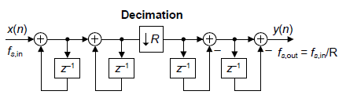

   

# Tiny Tapeout Verilog Project

- [Read the documentation for project](docs/info.md)

## What is Tiny Tapeout?

Tiny Tapeout is an educational project that aims to make it easier and cheaper than ever to get your digital and analog designs manufactured on a real chip.

To learn more and get started, visit https://tinytapeout.com.

## CIC Decimation filter for Sigma Delta Modulator

This project is the first part of the plan for taping out a Sigma-Delta ADC (Analog to Digital Converter). Although this Mixed-Signal design is on its way, it is not ready to be put on a shuttle. Therefore I will be only taping out the decimation filter of the ADC to test it and get a feeling of the tape-out process. At a later point I hope to combine this together with the analog part (the modulator).

Simply said, a Sigma Delta ADC consist out of two main parts, a modulator, and a filter. In my case the design consists of a modulator which will convert an analog sigmal into a fast switching 1-bit signal which will have an average propotional to the analog input signal. Although there are major differences, it has a lot of similarities to a PWM signal. 
The second part will be a decimation low pass filter which will take this 1-bit signal and convert it to a multi-bit digital signal at a lower rate (10 or 20 bits depending on the selected filter).

As decimation filter, I decided to go with a Cascased Integrator-Comb filter. The reason I chose for such filter is that is it relatively small for its performance (amount of registers) and a decimation part can be nicely build into it, which reduces the amount of registers needed for the Comb part. I recommend reading the following:
- [A Beginners guide to Cascaded Intergrator Comb Filters](https://www.dsprelated.com/showarticle/1337.php)

I integrated two comb filters, which can be selected using the ui[1] bit. The first one (1'b0) is the first order implementation, and the second one (1'b1) is a Second order filter.

For both designs, I used a decimation ratio of 1024 (2^10). This means that the output signals changes for every 1024 input values.

### First Order CIC filter:

The first design is a first order CIC filter, which means it has a single integrator, and a single comb stage. It has a 10 bit output. 

![First Order CIC filter [1]](CIC_digital_filters_fig1.png)

### Second Order CIC filter:

The latter is a second order CIC filter, which means it has 2 integrators, and two comb stages. This part has 20 bits output (not all bits can be seen at the same time at the output).

[1] https://www.dsprelated.com/showarticle/1337.php

